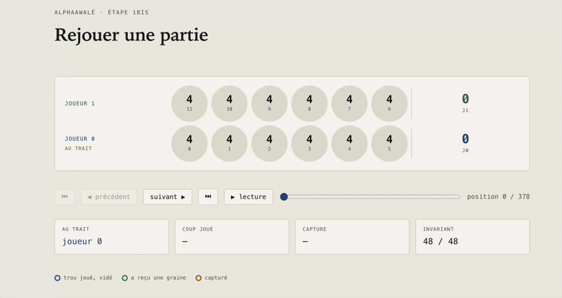

# AlphaAwalé

Un projet en Python pour appliquer les principes d’AlphaZero au jeu de l’Awalé.



*Le lecteur de parties : relecture coup par coup, repérage des semis et des
captures, contrôle des 48 graines.*

L’idée est née après avoir regardé *The Thinking Game*. Les travaux de DeepMind
sur AlphaGo et AlphaZero m’ont donné envie de comprendre comment un agent peut
apprendre à jouer en affrontant ses propres versions. Avec AlphaAwalé, je cherche
à explorer cette démarche en la reconstruisant étape par étape.

L’objectif est de faire apprendre un agent sans utiliser de parties humaines,
puis de mesurer la qualité de ses décisions face à un oracle de finales : une
base de positions dont le résultat optimal est calculé.

**Le projet est en cours de développement.** Le moteur de jeu et le lecteur de
parties sont terminés. La recherche arborescente, l’oracle et l’apprentissage
constituent les prochaines étapes. Il s’agit d’un projet personnel
d’apprentissage, sans affiliation avec DeepMind.

## Pourquoi l’Awalé

L’Awalé offre un terrain d’expérimentation compact : deux rangées de six trous,
quarante-huit graines et au maximum six coups à examiner à chaque tour. Le jeu
est déterministe et les deux joueurs disposent de toute l’information sur le
plateau.

Cette simplicité du matériel laisse place à des décisions intéressantes :
préparer une capture, anticiper le semis suivant ou nourrir l’adversaire quand
son camp est vide. Elle permet aussi de commencer par un moteur que l’on peut
inspecter et tester sans GPU.

Les travaux de Romein et Bal sur la résolution de l’Awari constituent une autre
motivation. Le projet prévoit de construire son propre oracle sur un ensemble
limité de finales, afin de disposer d’une référence exacte pour l’évaluation.

## Ce que je veux mesurer

Les matchs contre des joueurs de référence permettront de suivre les progrès de
l’agent. L’oracle apportera une mesure complémentaire : **la proportion de
positions de finale dans lesquelles l’agent choisit un coup optimal**.

L’évaluation portera sur un échantillon de positions de l’oracle, avec un nombre
de positions et un protocole documentés. Si plusieurs coups sont optimaux dans
une position, chacun devra être accepté.

Cette mesure restera limitée aux finales couvertes par l’oracle. Elle ne suffira
pas, à elle seule, à décrire le niveau de l’agent sur une partie entière.

## Comment l’agent apprendra

L’implémentation visée repose sur trois éléments qui se renforcent au fil de
l’entraînement :

1. **Un réseau de neurones** évalue une position et propose une distribution sur
   les coups possibles : les sorties « valeur » et « politique ».
2. **Une recherche arborescente Monte-Carlo (MCTS)** explore les suites de coups,
   guidée par les prédictions du réseau.
3. **Des parties contre lui-même (self-play)** fournissent les exemples
   d’entraînement : les choix de la recherche et les résultats des parties.

Le réseau sera ensuite mis à jour à partir de ces exemples, avant de générer de
nouvelles parties. Aucune partie humaine ne sera utilisée pour l’entraînement.
L’oracle servira de référence d’évaluation, séparément de cette boucle.

La méthode suit l’algorithme AlphaZero décrit par Silver et ses coauteurs dans
*Science* en 2018. L’implémentation sera construite progressivement à partir de
ces travaux.

## État du projet

| Étape | État | Contenu |
|---|---|---|
| Moteur de jeu | Terminé | État du plateau, coups légaux, semis, captures et fin de partie |
| Lecteur de parties | Terminé | Relecture coup par coup, repérage des semis et captures, contrôle des 48 graines |
| Joueurs de référence | À construire | Joueur aléatoire dédié, puis minimax avec élagage alpha-bêta |
| MCTS pur | À construire | Recherche UCT avec simulations aléatoires, sans réseau |
| Oracle de finales | À construire | Analyse rétrograde, avec une cible de dix-huit graines à évaluer selon les ressources nécessaires |
| Agent AlphaZero | À construire | Réseau politique/valeur, MCTS guidé et self-play |
| Évaluation | À construire | Comparaison à l’oracle et aux joueurs de référence au fil de l’entraînement |

Le moteur permet déjà de générer une partie aléatoire pour le lecteur. Le module
consacré aux joueurs de référence reste à développer.

La validation du moteur documentée à ce stade porte sur **10 000 parties
aléatoires et 1 034 220 coups**, sans exception ni rupture de l’invariant des
48 graines. Après le ramassage final, les scores totalisent toujours 48 graines.

## Règles retenues

Le moteur utilise la variante définie pour ce projet, avec **grand chelem
autorisé** : un coup qui capture toutes les graines restantes du camp adverse
effectue la capture et termine la partie.

Les mécanismes principaux sont les suivants :

- Douze trous, avec quatre graines par trou au départ.
- Semis dans le sens antihoraire, en sautant le trou d’origine lors d’un tour complet.
- Capture lorsque la dernière graine porte un trou adverse à deux ou trois graines,
  puis capture en chaîne des trous précédents qui remplissent les mêmes conditions.
- Obligation de nourrir l’adversaire lorsque son camp est vide, si un coup le permet.
- Victoire à vingt-cinq graines capturées ; égalité à vingt-quatre partout.

La compatibilité exacte des règles et des conditions de fin avec l’oracle devra
être vérifiée lors de sa construction. Changer de variante nécessiterait de
recalculer les données concernées et de refaire les évaluations.

## Validation

Chaque étape doit être vérifiée avant de servir de base à la suivante. Les seuils
ci-dessous sont des objectifs de validation ; seul celui du moteur est franchi
à ce stade.

| Étape | Objectif |
|---|---|
| Moteur | Terminer 10 000 parties aléatoires sans exception et conserver les 48 graines à chaque coup |
| Minimax | À profondeur 6, gagner plus de 95 % des parties contre le joueur aléatoire, selon un protocole à fixer |
| MCTS pur | Avec 1 000 simulations par coup, dépasser minimax profondeur 4 sur une série de matchs |
| Oracle | Vérifier les positions terminales et la cohérence des valeurs avec les transitions légales |
| AlphaZero | Mesurer l’évolution du taux de coups optimaux sur un échantillon d’évaluation fixe |

L’invariant du moteur s’écrit :

```python
sum(etat["trous"]) + sum(etat["scores"]) == 48
```

Il détecte toute perte ou duplication de graines. Il doit être complété par des
vérifications des règles : conserver le bon total ne garantit pas, à lui seul,
qu’un coup est correct.

## Lancer le projet

Depuis la racine du projet, avec Python 3.13 ou plus :

```bash
python3 src/jeu.py
```

Le script exécute des vérifications et génère une partie aléatoire dans
`donnees/partie.json`.

Pour la rejouer dans le navigateur, lancer ensuite un serveur local :

```bash
python3 -m http.server 8000
```

Ouvrir [le lecteur de parties](http://localhost:8000/viewer.html).
Il permet de parcourir la partie, de lancer la lecture automatique et de suivre
les semis, les captures et le total des graines.

Le moteur et le lecteur actuels ne nécessitent pas PyTorch. La pile prévue pour
les étapes d’apprentissage comprend NumPy, PyTorch avec le backend MPS sur Apple
Silicon, et pytest pour les tests.

## Organisation

Les fichiers présents pour les premières étapes :

```text
src/
    jeu.py            moteur, vérifications et export d’une partie aléatoire
    joueurs.py        module à développer
viewer.html           lecteur de parties
donnees/              données générées
tests/                répertoire prévu pour les tests
```

Les modules prévus pour la suite :

```text
src/
    mcts.py            recherche arborescente Monte-Carlo
    reseau.py          réseau avec sorties politique et valeur
    selfplay.py        génération des parties d’entraînement
    entrainement.py    boucle d’apprentissage
    finales.py        construction de l’oracle par analyse rétrograde
    evaluation.py     matchs et mesure du taux de coups optimaux
```

## Références

*The Thinking Game* a été le point de départ personnel du projet. Les publications
suivantes constituent ses références techniques :

- Silver et al., *Mastering the game of Go without human knowledge*,
  **Nature**, 2017. Travaux sur AlphaGo Zero.
  [Article](https://www.nature.com/articles/nature24270) ·
  [Présentation par DeepMind](https://deepmind.google/blog/alphago-zero-starting-from-scratch/).
- Silver et al., *A general reinforcement learning algorithm that masters chess,
  shogi, and Go through self-play*, **Science**, 2018. Référence pour AlphaZero.
  [Article](https://www.science.org/doi/10.1126/science.aar6404) ·
  [Présentation par DeepMind](https://deepmind.google/blog/alphazero-shedding-new-light-on-chess-shogi-and-go/) ·
  [Prépublication PDF](https://storage.googleapis.com/deepmind-media/DeepMind.com/Blog/alphazero-shedding-new-light-on-chess-shogi-and-go/alphazero_preprint.pdf).
- Romein et Bal, *Awari is Solved*, **ICGA Journal**, 2002.
  Référence pour les travaux sur la résolution du jeu.
  [Notice](https://www.semanticscholar.org/paper/Awari-is-Solved/9651f4a7fd03be889d1e8a47407471ca38d68381).
